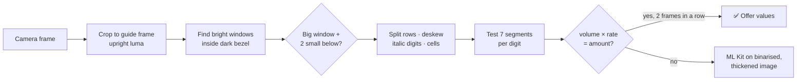
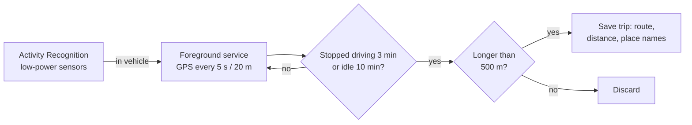
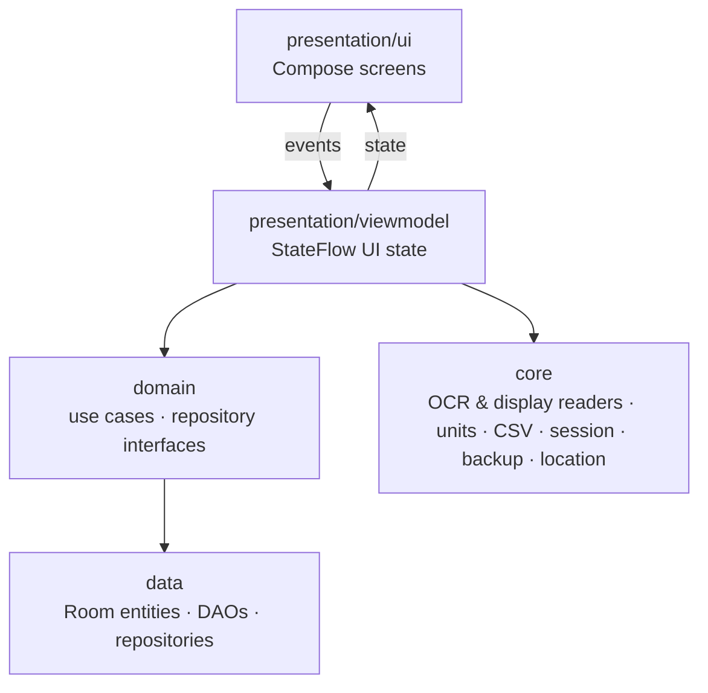

<div align="center">


# Odo

**A private, offline-first vehicle logbook for Android.**<br/>
Track fuel, services, expenses and trips — or just point your camera at the pump and let GPS log your drives.

[](https://github.com/maxcodl/Odo/releases)


[**Download the latest APK**](https://github.com/maxcodl/Odo/releases/latest) · [Features](#features) · [Build](#build) · [Architecture](#architecture)

</div>

---

## Screenshots

<table>
  <tr>
    <td align="center"><br/><sub><b>Home</b> — 30-day metrics & recent activity</sub></td>
    <td align="center"><br/><sub><b>Log feed</b> — every entry, filterable</sub></td>
    <td align="center"><br/><sub><b>Analytics</b> — monthly spend & fuel economics</sub></td>
  </tr>
  <tr>
    <td align="center"><br/><sub><b>Log fill-up</b> — rate prefilled, auto-calc</sub></td>
    <td align="center"><br/><sub><b>Pump scanner</b> — reads the 7-segment display</sub></td>
    <td align="center"><br/><sub><b>Settings</b> — Monet, AMOLED, backups</sub></td>
  </tr>
</table>

---

## Features

### 📷 Scan instead of type

- **Pump display scanner** — a live camera finds the pump's LCD windows (Amount, Volume, Rate) inside their dark bezel and decodes the **7-segment digits directly**, segment by segment. A reading is only offered once `litres × rate = amount` checks out across consecutive frames.
- **Odometer scanner** — a two-pass read: first locate the `ODO` label or `km` unit, then re-read just that region enlarged, contrast-stretched and inverted. Readings below your last odometer value are rejected rather than guessed.
- **Gallery import** — both scanners also work on existing photos; printed receipts are parsed too.
- **100% on-device** — ML Kit's bundled model plus a custom decoder. No photo ever leaves the phone.

### ⛽ Logging

- **Fuel, service, expense, trip and odometer logs**, each with full create / edit / delete.
- **Smart fill-up form** — the fuel rate is prefilled from your last fill-up, and any two of quantity · rate · total calculate the third.
- **Partial-tank aware efficiency** — km/L (or mpg) is computed across partial fills correctly.
- **Odometer chronology checks** on every entry, so a typo can't break your stats.
- **Log feed** — swipe left/right between All · Fuel · Service · Expense · Trips, grouped by month with monthly totals. Filter by month or cost range, sort by date or cost, and search stations, services, notes and places.
- **Receipt photos** — attached receipts are copied into private app storage and shown on the fill-up.
- **Multi-vehicle** — cars and bikes, each with its own distance unit, fuel unit and currency; view one vehicle or all combined.

### 📊 Insight

- **Home dashboard** — 30-day fuel cost, fill-up count, efficiency trend chart, and a recent-activity feed you can tap into, edit, or delete (with undo).
- **Analytics** — total running cost, cost per km, projected yearly cost, cost breakdown donut, and a **monthly spend chart with amounts on every bar**.
- **Fuel price history** — price per litre (or gallon) at every fill-up, as a chart.
- **Station stats** — fill-ups, total spent, average price and km/L for each filling station; the cheapest is highlighted.
- **Trip report** — business vs personal distance for this month, last month, this year or all time, with a mileage-claim CSV export of business trips.

### 📍 Location (optional — each can be switched off in Settings → Location)

- **Pump detection** *(on by default)* — a new fill-up takes one GPS fix and fills in the station name: first from stations you've logged within 150 m (works offline), otherwise the nearest fuel station within 300 m on OpenStreetMap. The spot is shown on a map; tap 📍 to look again.
- **Automatic trip log** *(off by default)* — driving is detected with the phone's low-power motion sensors, and GPS runs only while you drive. The trip is saved with its route, distance and start/end place names. Save or discard it from the notification.
- **No API keys, no billing** — maps are OpenStreetMap via osmdroid, station lookup uses the public Overpass API, place names use Android's built-in Geocoder.

### 🔒 Your data

- **Offline-first** Room database — the app works fully without a network. The optional location features are the only parts that go online: your coordinates are sent to OpenStreetMap's Overpass API and Android's geocoder, and map tiles are downloaded from OpenStreetMap.
- **Google Drive backup** on a WorkManager schedule, into the app's private Drive folder.
- **CSV import / export** for spreadsheets or migrating from other apps.

### 🎨 Made to fit your phone

- Material You (**Monet**) dynamic color, **AMOLED** true-black mode, edge-to-edge layout, floating nav bar in solid / blurry / glassy styles, and a title bar that hides while scrolling.

---

## How the pump scanner works



The decoder lives in [`core/PumpDisplayReader.kt`](app/src/main/java/com/auto/odo/core/PumpDisplayReader.kt) and is plain Kotlin — its unit tests run against a synthetic display and a real pump photo on the JVM, no device needed.

---

## How automatic trips work



- **Battery:** near zero when not driving; roughly 3–6% per hour of driving while GPS records (less if the phone charges in the car).
- **Odometer:** GPS can't read the odometer, so a recorded trip starts from the vehicle's latest known reading and adds the GPS distance. Edit it afterwards if needed.
- **Setup:** Settings → Location shows a checklist — precise location, *Allow all the time*, physical activity, and unrestricted battery. Some phones (Xiaomi, Oppo, Vivo, Samsung…) still stop background apps; see [dontkillmyapp.com](https://dontkillmyapp.com/).
- **Known limits:** detection starts 1–2 minutes into a drive, so the route's first stretch is missing; passenger rides (bus, taxi) are recorded too — discard them from the notification; motorbike rides are sometimes classified as cycling and not recorded.

The recorder lives in [`core/location/AutoTrips.kt`](app/src/main/java/com/auto/odo/core/location/AutoTrips.kt); pump lookup, routes and distance helpers in [`core/location/Locations.kt`](app/src/main/java/com/auto/odo/core/location/Locations.kt).

### Permissions

| Permission | Used for | When asked |
| --- | --- | --- |
| Camera | Pump display & odometer scanners | First scan |
| Location (precise) | Pump detection, trip recording | New fill-up / enabling automatic trips |
| Location — *Allow all the time* | Recording trips while the app is closed | Automatic trips checklist |
| Physical activity | Detecting when you start and stop driving | Enabling automatic trips |
| Notifications | Trip recording / trip saved notifications | Enabling automatic trips |
| Ignore battery optimisation | Keeping the recorder alive on aggressive phones | Automatic trips checklist (optional) |

---

## Build

Requirements: **JDK 17** and the **Android SDK (API 36)**. Point `sdk.dir` in `local.properties` at your SDK.

```bash
./gradlew testDebugUnitTest assembleDebug
```

If the wrapper is not executable after cloning: `chmod +x gradlew`.

### Release builds

Release builds require a signing keystore and are normally produced by CI (see [Releases](#releases)), not built locally. For a local signed build, provide these in `local.properties` or as environment variables — `keystore.path`, `keystore.password`, `key.alias`, `key.password` (or `KEYSTORE_FILE`, `KEYSTORE_PASSWORD`, `KEY_ALIAS`, `KEY_PASSWORD`) — then run:

```bash
./gradlew assembleRelease
```

Release builds run through R8 minification and resource shrinking; see `app/proguard-rules.pro` for the keep rules needed by Room, Hilt, and the Google Drive API client.

---

## Architecture

Clean Architecture, MVVM, unidirectional data flow (StateFlow → Compose UI).



| Layer                     | Contents                                                                                                               |
| ------------------------- | ---------------------------------------------------------------------------------------------------------------------- |
| `data/`                   | Room entities, DAOs, `AppDatabase`, repository implementations                                                         |
| `domain/`                 | Repository interfaces and use cases (metrics, log feed assembly, odometer chronology validation)                       |
| `presentation/viewmodel/` | One `StateFlow`-backed UI state per screen; owns all business / interaction logic                                      |
| `presentation/ui/`        | Compose screens and reusable components, including the live camera scanner. Screens only talk to ViewModels            |
| `core/`                   | Pump display & odometer readers, text parsing, unit conversion, CSV import/export, DataStore session, Drive backup job |
| `core/location/`          | GPS fixes, pump lookup (saved stations → Overpass), route encoding, trip recorder service and its receivers           |
| `di/`                     | Hilt modules wiring Room, DataStore, and networking                                                                    |

**Tech:** Kotlin · Jetpack Compose (Material 3) · Hilt · Room · DataStore · WorkManager · CameraX · ML Kit Text Recognition · Play Services Location (fused location, Activity Recognition) · osmdroid · Navigation Compose

### Key conventions

- Odometer values are stored internally in **kilometers**; fuel quantities in **liters**. UI/ViewModel layers convert to each vehicle's display units — never store display units in the database.
- The active vehicle is tracked centrally via DataStore (`UserSessionManager`); screens collect it rather than holding their own copy.
- Editing an existing log reuses the same Add-screen/ViewModel pair used for creation (loaded via an optional `editId` nav argument), rather than separate Edit-screen files, to avoid duplicating validation and calculation logic.
- Odometer chronology is validated on every fuel/service/trip/odometer insert or update; edits exclude their own prior value from that check.
- Trip routes are stored on the trip row as `lat,lon;lat,lon;…` (5 decimals) — see `Route` in `core/location/Locations.kt`.
- Database schema changes bump the `AppDatabase` version and add a `Migration`; there is no destructive fallback, so users never lose logs on update.
- Bottom-tab navigation — including in-screen shortcuts like "View All" — goes through one `navigateToTab` function so tab back stacks are saved and restored consistently.

---

## Releases

Two GitHub Actions workflows build signed release artifacts:

- **`beta`** — triggered on push to the `beta` branch. Builds a signed APK, tags it `beta-v<versionName>-b<run number>`, and publishes it as a pre-release with an auto-generated changelog since the previous beta.
- **`stable`** — triggered by pushing a `v*` tag (e.g. `v1.0.4`). Builds a signed APK **and** AAB, and publishes a full release with a changelog since the previous stable tag.

Both changelogs are generated from commit messages between tags, not PR titles — write descriptive commit messages.

---

## Contributing

- Odometer values are stored internally in kilometers; fuel quantities in liters. Convert to display units only in UI code.
- CSV import replaces the local database — validate CSVs before deleting existing data.
- New or changed Room columns need a `Migration` in `AppDatabase` (see `MIGRATION_1_2`).
- Location logic that can be pure Kotlin (distances, station matching, route encoding) belongs in `core/location/Locations.kt` with a test in `LocationsTest`.
- When adding a new log type or field to the edit flow, mirror the existing `AddFillUpViewModel` edit-mode pattern (`SavedStateHandle`-driven `editId`, load-by-id, update-instead-of-insert) rather than introducing a new pattern.
- Scanner changes: add a failing case to `PumpDisplayReaderTest` / `TextScannerTest` / `OdometerReaderTest` first — the parsers and decoders are pure Kotlin and fast to test.

<div align="center">
<sub>Built with ☕ by <a href="https://github.com/maxcodl">max</a></sub>
</div>
